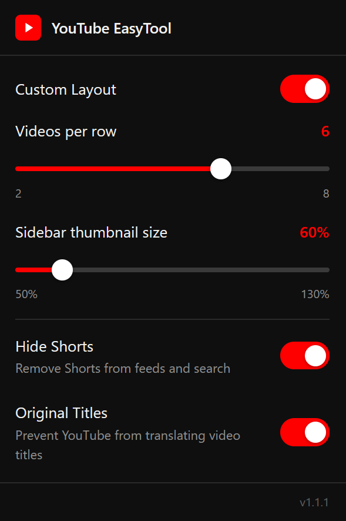

# YouTube EasyTool

A browser extension for Chrome and Firefox that fixes YouTube's most annoying defaults: auto-translated titles, unwanted Shorts in your feed, a rigid video grid, and an oversized sidebar.

> **Now available on the [Chrome Web Store](https://chromewebstore.google.com/detail/youtube-easytool/mpobhamgihljgnjoeohcfigenodfclik)** 

> Firefox Add-ons submission is still pending review.

## Preview

## Features

**Grid Layout** — Set the exact number of video columns on the YouTube home and subscriptions pages, from 2 to 8. The change is instant and the setting is remembered across sessions.

**Sidebar Thumbnail Size** — Resize the video thumbnails in the watch page sidebar. Drag the slider from 50% to 130% of the default size. Only affects the related videos panel — all other pages are untouched.

**Hide Shorts** — Remove YouTube Shorts from your home feed, search results, and subscription feed. The Shorts section in the sidebar remains accessible if you want to browse it directly.

**Original Titles** — Prevent YouTube from auto-translating video titles into your browser's language. Titles are shown in their original language.

## Installation

### Chrome

Install directly from the **[Chrome Web Store](https://chromewebstore.google.com/detail/youtube-easytool/mpobhamgihljgnjoeohcfigenodfclik)**.

Alternatively, you can install it manually:

1. Download this repository — click **Code → Download ZIP** on GitHub and unzip it
2. Open Chrome and go to `chrome://extensions`
3. Enable **Developer Mode** (toggle in the top-right corner)
4. Click **Load unpacked** and select the folder you just unzipped
5. The YouTube EasyTool icon appears in your toolbar

### Firefox

**Temporary install** (removed when Firefox restarts):

1. Download and unzip the repository
2. Go to `about:debugging#/runtime/this-firefox`
3. Click **Load Temporary Add-on** and select `manifest.json` from the unzipped folder

**Permanent install** (without submitting to AMO):

1. Download and unzip the repository
2. Zip the contents of the unzipped folder and rename the file to `youtube-easytool.xpi`
3. Go to `about:addons`, click the gear icon, then **Install Add-on From File**
4. Select the `.xpi` file

> Note: Firefox requires Developer Edition or setting `xpinstall.signatures.required` to `false` in `about:config` for unsigned add-ons.

## How to use

Click the YouTube EasyTool icon in your browser toolbar while on any YouTube page. Toggle features on or off, some changes take effect immediately on the current page, for other you may need to refresh.

## Upcoming features

- Auto-expand video descriptions
- Hide end screen cards

## License

[MIT](LICENSE)
