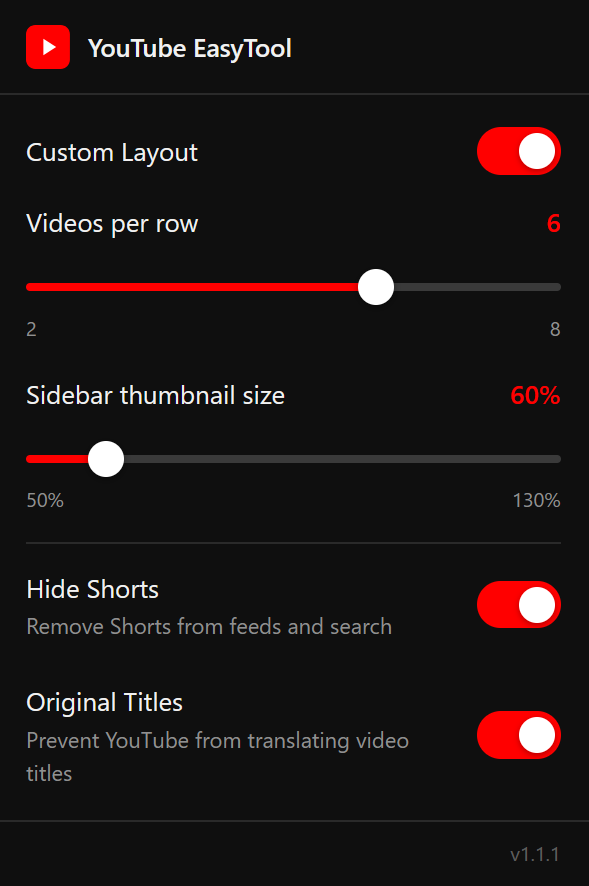

# YouTube EasyTool

A browser extension for Chrome and Firefox that fixes YouTube's most annoying defaults: auto-translated titles, unwanted Shorts in your feed, a rigid video grid, and an oversized sidebar.

## Install

> 🦊 **Firefox** — [Mozilla Add-ons](https://addons.mozilla.org/en-US/firefox/addon/youtube-easytool/)

> 🌐 **Chrome / Edge / Brave / Opera** — [Chrome Web Store](https://chromewebstore.google.com/detail/youtube-easytool/mpobhamgihljgnjoeohcfigenodfclik)

## Preview

## Features

**Grid Layout** — Set the exact number of video columns on the YouTube home and subscriptions pages, from 2 to 8. The change is instant and the setting is remembered across sessions.

**Sidebar Thumbnail Size** — Resize the video thumbnails in the watch page sidebar. Drag the slider from 50% to 130% of the default size. Only affects the related videos panel — all other pages are untouched.

**Hide Shorts** — Remove YouTube Shorts from your home feed, search results, and subscription feed. The Shorts section in the sidebar remains accessible if you want to browse it directly.

**Original Titles** — Prevent YouTube from auto-translating video titles into your browser's language. Titles are shown in their original language.

## How to use

Click the YouTube EasyTool icon in your browser toolbar while on any YouTube page. Toggle features on or off, some changes take effect immediately on the current page, for other you may need to refresh.

## Upcoming features

- Auto-expand video descriptions
- Hide end screen cards

## License

[MIT](LICENSE)
